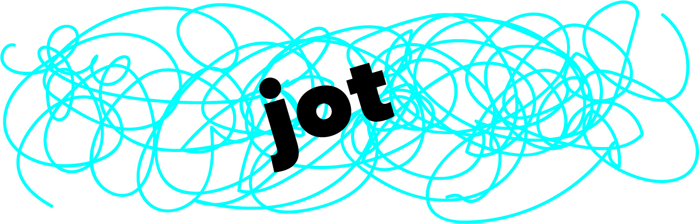
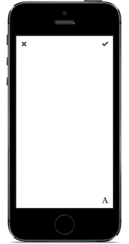

[](http://ifttt.github.io)



[](http://cocoadocs.org/docsets/jot) [](https://travis-ci.org/IFTTT/jot) [](https://coveralls.io/r/IFTTT/jot?branch=master)

`jot` is an easy way to add touch-controlled drawings and text to images in your iOS app.



## What's `jot` for?
### Annotating Images
`jot` is the easiest way to add annotations to images with a touch interface. You can draw arrows or circle important things, as well as add resizable, rotatable text captions, and easily save the notes on top of a image using `drawOnImage:`.

### Whiteboard or Drawing Apps
`jot` is perfect for quick sketches and notes in your whiteboard or drawing app. It's easy to change the drawing color or stroke width, and when you're done, you can call `renderImageOnColor:` to save the sketch.

### Signatures
`jot` is a great solution if you need to collect user signatures through a touch interface. Set the `drawingColor` to black, set the state to `JotViewStateDrawing`, and save the signature when the user is done by calling `renderImageOnColor:`.

## Installation

`jot` is available through [CocoaPods](http://cocoapods.org). To install
it, simply add the following line to your `Podfile`:

```
pod "jot"
```

## Example Project

To run the example project, clone the repo, and run `pod install` from the `Example` directory.

## Usage

Add an instance of `JotViewController` as a child of your view controller. Adjust the size and layout of `JotViewController `'s view however you'd like.

```objc
#import "ExampleViewController.h"
#import <jot.h>

@interface ExampleViewController ()
@property (nonatomic, strong) JotViewController *jotViewController;
@end

@implementation ExampleViewController

- (void)viewDidLoad
{
    [super viewDidLoad];
    _jotViewController = [JotViewController new];
    self.jotViewController.delegate = self;
    
    [self addChildViewController:self.jotViewController];
    [self.view addSubview:self.jotViewController.view];
    [self.jotViewController didMoveToParentViewController:self];
    self.jotViewController.view.frame = self.view.frame;
}
```
Switch between drawing, text manipulation, and text edit mode.

```objc
- (void)switchToDrawMode
{
	self.jotViewController.state = JotViewStateDrawing;
}

- (void)switchToTextMode
{
	self.jotViewController.state = JotViewStateText;
}

- (void)switchToTextEditMode
{
	self.jotViewController.state = JotViewStateEditingText;
}
```
Clear the drawing.

```objc
// Clears text and drawing
[self.jotViewController clearAll];

// Clears only text
[self.jotViewController clearText];

// Clears only drawing
[self.jotViewController clearDrawing];
```

### Image Output

Draw on a background image.

```objc
- (UIImage *)imageWithDrawing
{
	UIImage *myImage = self.imageView.image;
	return [self.jotViewController drawOnImage:myImage];
}
```

Draw on a color.

```objc
- (UIImage *)imageOnColorWithDrawing
{
	UIColor *backgroundColor = self.view.backgroundColor;
	return [self.jotViewController renderImageOnColor:backgroundColor];
}
```

Draw on a transparent background.

```objc
- (UIImage *)imageOnColorWithDrawing
{
	UIColor *backgroundColor = self.view.backgroundColor;
	return [self.jotViewController renderImage];
}
```

### Basic Configuration

#### Text Settings

Change the font.

```objc
self.jotViewController.font = [UIFont boldSystemFontOfSize:64.f];
```
Change the font size.

```objc
self.jotViewController.fontSize = 64.f;
```
Change the text color.

```objc
self.jotViewController.textColor = [UIColor redColor];
```
Set the initial text string.

```objc
self.jotViewController.textString = @"Hello World";
```

#### Drawing Settings

Change the drawing stroke color.

```objc
self.jotViewController.drawingColor = [UIColor magentaColor];
```
Change the drawing stroke width.

```objc
self.jotViewController.drawingStrokeWidth = 10.f;
```
Make the drawing stroke a constant width, instead of the default dynamically variable width.

```objc
self.jotViewController.drawingConstantStrokeWidth = YES;
```

### Advanced Configuration

#### Text Settings

Set the text to wrap to the width of the view.

```objc
self.jotViewController.fitOriginalFontSizeToViewWidth = YES;
```
Set the text alignment (only applies if text is set to wrap).

```objc
self.jotViewController.textAlignment = NSTextAlignmentRight;
```
Set the text insets (only applies if text is set to wrap).

```objc
self.jotViewController.initialTextInsets = UIEdgeInsetsMake(10.f, 10.f, 10.f, 10.f);
```
Set the text editing insets.

```objc
self.jotViewController.textEditingInsets = UIEdgeInsetsMake(10.f, 10.f, 10.f, 10.f);
```
Set the text edit view to clip text to the text editing insets (instead of fading out with a gradient).

```objc
self.jotViewController.clipBoundsToEditingInsets = YES;
```

## Contributors

* [Laura Skelton](https://github.com/lauraskelton), creator.

## License

`jot` is available under the MIT license. See the LICENSE file for more info.

Copyright 2015 IFTTT Inc.
